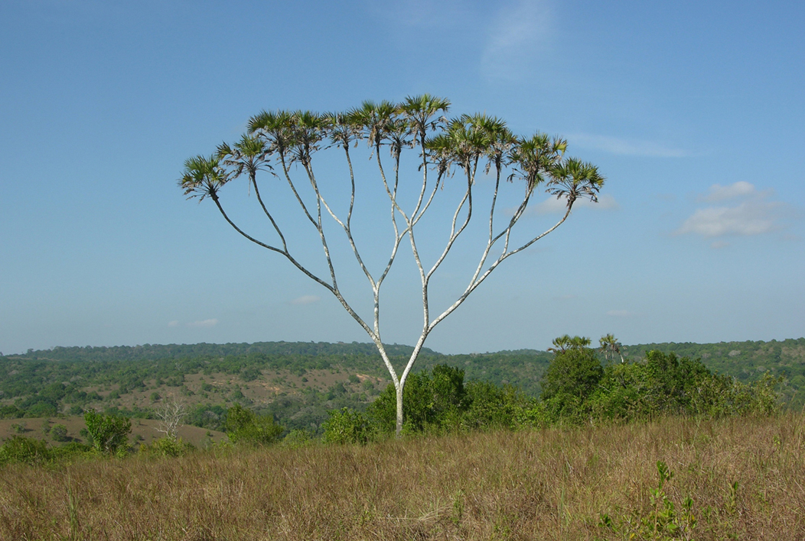
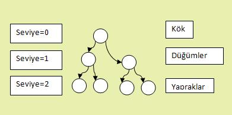
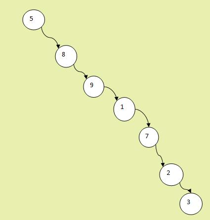

## Nasıl kullanılır
### Daha önceden hazırlanmış örnekleri çalıştırmak için

* % make
* ./test/test

# Red Black Tree (Kırmızı Siyah Ağaçlar)
Bu yazı boyunca Red Black Tree ağaçları, kelimelerinin baş harflerinden oluşan RBT şeklinde kısaltılacaktır.

## Bilgisayar bilimlerinde ağaç yapısının genel tanımı
RBT özelleştirilmiş öz-dengeli ikili arama ağacıdır. öz-dengeli ikili arama ağaçlarını gerçek bir ağaca benzetirsek bir kökü ve bu köke bağlanan dallardan oluşurlar. Eğer bu kök ve dallar arasında ikili bir ilişki varsa yani kökden iki dal çıkıyor ve her dalın ukuncanda aynı şekilde iki dal ayrılıyor ise buna İkili ağaç diyoruz. Benzetmeyi daha iyi kurabilmek için hem gerçek bir ağacın hemde bilgisayar bilimlerinde kullanılan graf yapısıyla çizilmiş bir ağacın şekli aşağıda görebiliriz.

Graf teoremi ile çizilmiş ağaçtaki her siyah yuvarlağa bir **düğüm**(node) ve bu düğümleri birbirine bağlayan çizğilere ile **kenar** (egde) ismini veriyoruz. Bizim graf ağacımızın en üstünde bulunan ve diğer tüm düğümlerin başlangıcı olan düğüme **Kök düğümü** (Root node) ve en sonda bulunan ve herhangi bir dalı olmayan düğümlere ise **yaprak düğümü** (Leaf node) adını veriyoruz.

Herhangi bir düğümün altında yer alan ve edge ile bağlı olan düğümlere **Çocuk düğüm** (Child node), düğüme yukarıdan bağlı olan ve bizden önce gelen düğüme ise **Ata** yada **Ebebeyn** düğüm (Parent Düğüm) adı verilir. Birbaşka değişle, kenarlar ile bağlı olduğumuz düğümlerden kök düğümüne bize göre daha yakın olan düğümler **ata** köke daha uzak olanlar ise **çocuk** diyebiliriz. Örneğin düğümlere içlerinde yazan rakamları isimleri kabul edersek 3 ve 2 numaralı düğümler 7 numaralı düğümün çocuğu iken 5 numaralı düğüm 7 numaralı düğümün atasıdır diyebiliriz. Kök düğümünden en uzaktaki yaprak düğümüne giderken geçilen edge sayısına **yükseklik** ismini veriyoruz ve genelde **h** ile belirtilir.

## Öz-dengeli ağaçlar nedir?

Yukarıdaki Resimde farklı bir ağaç görüyoruz kök düğümü 5 numaralı düğüm olan bu ağacın tüm düğümlerinin çocukları sağ tarafta ve bu durumda ağacın solu bonboş durumda, bu hali ile ağaç olarak kabul edebiliriz ancak sağ ve sol taraftaki düğüm sayısını ve yüksekliğini karşılaştırdığımızda dengesiz bir ağaç olduğu aşikar. 

Dengeli ağaçlarda amacımız ağaç oluşturulurken belirli kurallar tannımlarız ve ağaca eleman ekleme veya silme işlemlerini bu kurallara uyarak yaparız bu sayede ağacın belirli özellikleri sağlamasını garanti ederiz. Garanti edilen özellikler ağaçlara ve kurallara bağlı olarak değişir. Bizim bu yazının geri kalanında işleyeceğimiz RBT'ler ise ağacın dengeli olmasını sağlamak için belirli kurallar koymuşlardır.

## Red Black Tree Kuralları ve Amaçları
RBT adındanda anlaşılacağı gibi düğümlere farklı renk atamaları yapar ve bu renkler sayesinde verilen kurallarla ağaçta denge sağlanır. Denge ağaca yapılacak değişikliklerin (ekleme, silme, arama) daha hızlı olmasını sağlar. RBT veriyi tutuş şekli sayesinde ekleme, arama, silme gibi temel işlevlerin en kötü durum analizinde (worst case analysis) O(logn)'dir, yani n eleman için bu işlemleri ön kötü durumda **O(*logn*)** zamanda yapacağını garanti eder.

### RBT için Kurallarımız
1. Ağaçtaki tüm düğümlerin bir rengi vardır, bu renk **kırmızı** ya da **siyah** olabilir.
2. Kök düğümü her zaman **siyah** renktedir.
3. Tüm yaprak düğümler **siyah** renktedir.
3. Herhangi bir *kırmızı* renkli düğümün çocukları **siyah** renktedir.
4. Herhangi bir düğümden, yaprak düğüme kadar gidilen bütün yollarda eşit sayıda **siyah** düğüm bulunur.

## Red Black Tree Temel İşlemler

### Arama İşlemi (Search)
Ağaç üzerinde bir değer ararken önce kök düğümüne bakılır, eğer aranan değer kök düğümü ise arama bitti demektir. Aranan kök düğümü değilse aranan değer ile kök düğümü karşılaştırılır, aranan değer kök düğümün değerinden küçükse sola büyükse sağa gidilir, ve gidilen düğüm içinde yukarıdakiler tekrarlanır. Aranan değer bulunana kadar ya da boş (Null) değere ulaşıncaya kadar bu işlem devam eder.

### Ekleme İşlemi (İnsertion)

## Kullanılan Terimlerin İngilizceleri
Bu Terimlerin ingilizcelerini ve kısaltmalarını bilmek birçok yerde yararlı olacaktır. Birçok türkçe derste terimler ingilizce halleri ile kullanılmkatadır.

| Türkçe | İngilizce | Kısaltma|
| ------ | ------ | ------ |
| Edge | Kenar ||
| Düğüm | Node ||
| Root | Kök ||
| İkili Ağaç | Binary Tree |  |
| Kırmızı Siyah Ağaç| Red Black Tree | RBT |
|Öz-dengeli İkili Arama Ağacı | Binary Search Tree | BST |