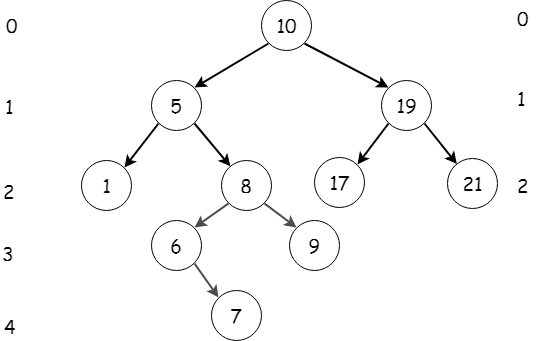

## Nasıl kullanılır
### Daha önceden hazırlanmış örnekleri çalıştırmak için

* % make
* ./test/test

# Red Black Tree (Kırmızı Siyah Ağaçlar)
Bu yazı boyunca Red Black Tree ağaçları, kelimelerinin baş harflerinden oluşan RBT şeklinde kısaltılacaktır.
## Nedir?
RBT özelleştirilmiş öz-dengeli ikili arama ağacıdır. öz-dengeli ikili arama ağaçlarını gerçek bir ağaca benzetirsek bir kökü ve bu köke bağlanan dallardan oluşurlar. Eğer bu kök ve dallar arasında ikili bir ilişki varsa yani kökden iki dal çıkıyor ve her dalın ukuncanda aynı şekilde iki dal ayrılıyor ise buna İkili ağaç diyoruz.

## Kullanılan Terimlerin İngilizceleri
Bu Terimlerin ingilizcelerini ve kısaltmalarını bilmek birçok yerde yararlı olacaktır. Birçok türkçe derste terimler ingilizce halleri ile kullanılmkatadır.

| Türkçe | İngilizce | Kısaltma
| ------ | ------ | ------ |
| İkili Ağaç | Binary Tree |  |
| Kırmızı Siyah Ağaç| Red Black Tree | RBT |
|Öz-dengeli İkili Arama Ağacı | Binary Search Tree | BST |
| Root | Kök ||